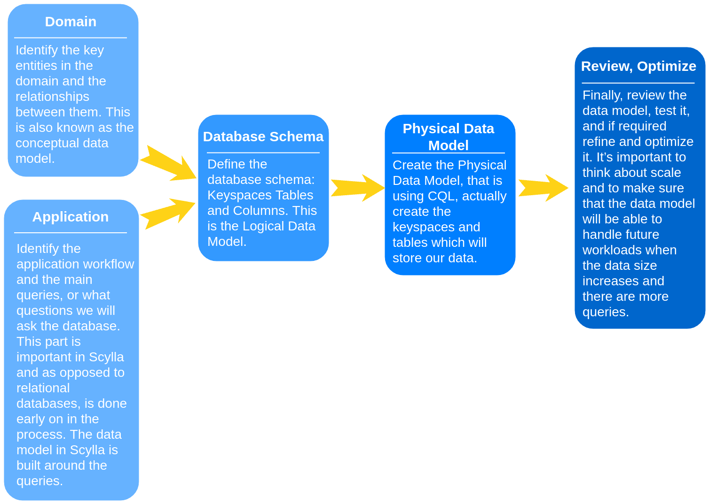
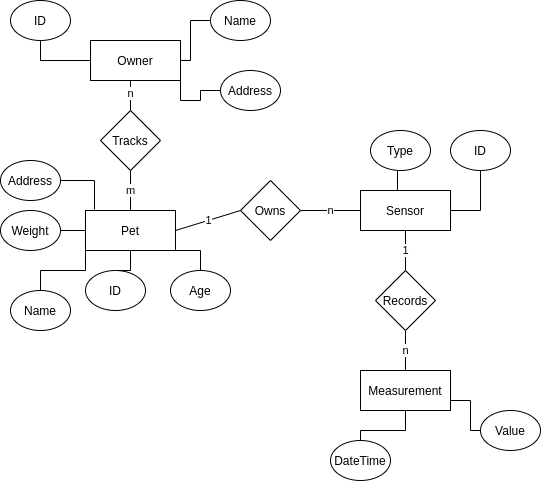
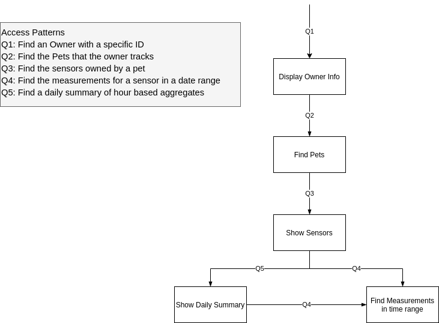
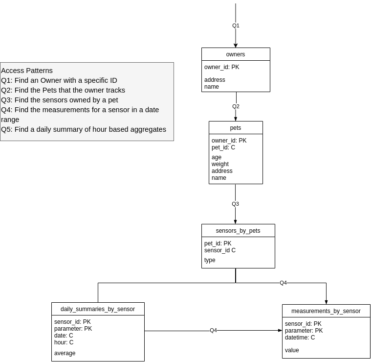

Design and Data Model
---------------------
You can learn more about Data Modeling in Scylla (and NoSQL) by taking ``this course`_ <https://university.scylladb.com/courses/data-modeling/>`_ on Scylla University. The main goal of data modeling in Scylla is to perform queries fast, even if we sometimes have to duplicate data.

Let’s build our schema around the queries we are going to run against our domain entities. When creating the data model, you need to consider both the conceptual data model and the application workflow: which queries will be performed by which users and how often. 

To achieve that, we want:

* Even data distribution
* To minimize the number of partitions accessed in a read query.

On the other hand, our focus won’t be on avoiding data duplication or minimizing the number of writes.

You’re probably familiar with the steps defined here:

Conceptual Data Model
^^^^^^^^^^^^^^^^^^^^^
Starting with the conceptual data model, we need to identify the key entities and the relationships between them. Our application has pets. Each dog can be tracked by many followers (typically the owners). A follower can also track more than one dog. Each dog can have a few sensors. Each sensor takes measurements:

Application Workflow
^^^^^^^^^^^^^^^^^^^^
Next, we move on to the Application Workflow. In this part, we identify the main queries or what questions we will ask the database. This part is important in Scylla, and other NoSQL databases and, as opposed to relational databases is performed early on in the data modeling process. Remember that our data modeling is built around the queries. 

Queries
^^^^^^^
Now we can detail the above queries in ``CQL`_ <https://university.scylladb.com/courses/data-modeling/lessons/basic-data-modeling-2/topic/cql-cqlsh-and-basic-cql-syntax/>`_:

Q1: Find a Follower with a specific ID
SELECT * FROM owner WHERE owner_id = ?

Q2: Find the pets that the follower tracks
SELECT * FROM pet WHERE owner_id = ?

Q3: Find the sensors of a pet
SELECT * FROM sensor WHERE pet_id = ?

Q4: Find the measurements for a sensor in a date range
SELECT * FROM measurements WHERE sensor_id = ? AND ts <= ? and ts >= ?;

Q5: Find a daily summary of hour based aggregates
SELECT * FROM sensor_avg WHERE sensor_id = ? AND date = ? ORDER BY date ASC, hour ASC;

Logical Data Model
^^^^^^^^^^^^^^^^^^
Using the outcomes of the application workflow and the conceptual data model, we can now create the logical data model. At this stage, we determine how our tables will look and which fields will be used as primary and clustering keys. Selecting a primary key and clustering key is highly important, you can learn more about it in ``this lesson`_ <https://university.scylladb.com/courses/data-modeling/lessons/basic-data-modeling-2/>`_. 

Remember that in Scylla, it’s better to duplicate data than to join, see more about denormalization in ``this lesson`_ <https://university.scylladb.com/courses/data-modeling/lessons/advanced-data-modeling/topic/denormalization/>`_. 

Physical Data Model
^^^^^^^^^^^^^^^^^^^
In this part, we take the Logical Data Model above and add CQL data types. Make sure you’re familiar with the ScyllaDB (and Cassandra for that matter) ``data types`_ <https://university.scylladb.com/courses/data-modeling/lessons/advanced-data-modeling/topic/common-data-types-and-collections/>`_ before proceeding. 

Based on the high availability requirements we will use a ``replication factor`_ <https://university.scylladb.com/courses/scylla-essentials-overview/lessons/high-availability/topic/fault-tolerance-replication-factor/>`_ (RF) of three. The RF is defined when we create the ``Keyspace`_ <https://university.scylladb.com/courses/data-modeling/lessons/basic-data-modeling-2/topic/keyspace/>`_, as we will see later on. 

Choosing the compaction strategy is explained ``here`_ <https://docs.scylladb.com/architecture/compaction/compaction-strategies/>`_ and in ``this`_ <https://university.scylladb.com/courses/scylla-operations/lessons/compaction-strategies/>`_ University Lesson. 

For the tables sensor_avg and measurement, we will use the ``Time Window Compaction Strategy (TWCS)`_ <https://docs.scylladb.com/getting-started/compaction/#time-window-compactionstrategy-twcs>`_. The reason is those tables contain time-series data. The “measurement” table stores sensor measurements, and the “sensor_avg” stores aggregated hourly averages. For such data, there is an optimized compaction strategy TWCS based on the Size Tiered Compaction Strategy with the fair assumption that the data at different time slots will never overlap. That isolates buckets compaction in-between the time windows into independent units reducing overall compaction write amplification.

For the other tables, we will use the default ``compaction strategy`_ <https://university.scylladb.com/courses/scylla-operations/lessons/compaction-strategies/>`_, ``Size Tiered Compaction Strategy (STCS)`_ <https://university.scylladb.com/courses/scylla-operations/lessons/compaction-strategies/topic/size-tiered-and-leveled-compaction-strategies-stcs-lcs/>`_. Remember that if you are using ``Scylla Enterprise`_ <https://www.scylladb.com/product/scylla-enterprise/>`_, you should probably be using ``Incremental Compaction Strategy (ICS)`_ <https://university.scylladb.com/courses/scylla-operations/lessons/compaction-strategies/topic/incremental-compaction-strategy-ics/>`_ as it offers better performance.  

We can now define the tables below, according to the physical data model. 

*CREATE TABLE IF NOT EXISTS owner (**    owner_id UUID,**    address TEXT,**    name    TEXT,**    PRIMARY KEY (owner_id)**);*

*CREATE TABLE IF NOT EXISTS pet (**    owner_id UUID,**    pet_id   UUID,**    age     INT,**    weight  FLOAT,**    address TEXT,**    name    TEXT,**    PRIMARY KEY (owner_id, pet_id)**);*

*CREATE TABLE IF NOT EXISTS sensor (**    pet_id UUID,**    sensor_id UUID,**    type TEXT,**    PRIMARY KEY (pet_id, sensor_id)**);*

*CREATE TABLE IF NOT EXISTS measurement (**    sensor_id UUID,**    ts       TIMESTAMP,**    value    FLOAT,**    PRIMARY KEY (sensor_id, ts)**) WITH compaction = { 'class' : 'TimeWindowCompactionStrategy' };*

*CREATE TABLE IF NOT EXISTS sensor_avg (**    sensor_id UUID,**    date    DATE,**    hour    INT,**    value   FLOAT,**    PRIMARY KEY (sensor_id, date, hour)**) WITH compaction = { 'class' : 'TimeWindowCompactionStrategy' };*

Some more advanced topics not covered in this guide are ``Collections`_ <https://university.scylladb.com/courses/data-modeling/lessons/advanced-data-modeling/topic/common-data-types-and-collections/>`_, User-Defined`` Types`_ <https://university.scylladb.com/courses/data-modeling/lessons/advanced-data-modeling/topic/user-defined-types-udt/>`_ (UDT), expiring data with ``time to live (TTL)`_ <https://university.scylladb.com/courses/data-modeling/lessons/advanced-data-modeling/topic/expiring-data-with-ttl-time-to-live/>`_, and ``Counters`_ <https://university.scylladb.com/courses/data-modeling/lessons/advanced-data-modeling/topic/counters/>`_.

To summarize, when data modeling with Scylla, we have to know our data, think about our queries, pay attention to the primary key and clustering key selection, and not be afraid to duplicate data. 

